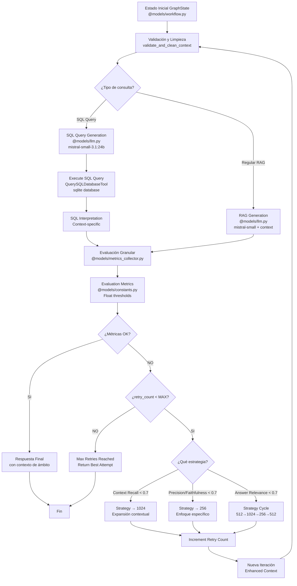

```mermaid
flowchart TD
    A[Estado Inicial GraphState<br/>@models/workflow.py] --> B[Validación y Limpieza<br/>validate_and_clean_context]
    
    B --> C{¿Tipo de consulta?}
    
    C -->|SQL Query| D[SQL Query Generation<br/>@models/llm.py<br/>mistral-small-3.1:24b]
    D --> E[Execute SQL Query<br/>QuerySQLDatabaseTool<br/>sqlite database]
    E --> F[SQL Interpretation<br/>Context-specific]
    
    C -->|Regular RAG| G[RAG Generation<br/>@models/llm.py<br/>mistral-small + context]
    
    F --> H[Evaluación Granular<br/>@models/metrics_collector.py]
    G --> H
    
    H --> I[Evaluation Metrics<br/>@models/constants.py<br/>Float thresholds]
    I --> J{¿Métricas OK?}
    
    J -->|SI| K[Respuesta Final<br/>con contexto de ámbito]
    
    J -->|NO| L{¿retry_count < MAX?}
    L -->|NO| M[Max Retries Reached<br/>Return Best Attempt]
    
    L -->|SI| N{¿Qué estrategia?}
    N -->|Context Recall < 0.7| O[Strategy → 1024<br/>Expansión contextual]
    N -->|Precision/Faithfulness < 0.7| P[Strategy → 256<br/>Enfoque específico]
    N -->|Answer Relevance < 0.7| Q[Strategy Cycle<br/>512→1024→256→512]
    
    O --> R[Increment Retry Count]
    P --> R
    Q --> R
    R --> S[Nueva Iteración<br/>Enhanced Context]
    S --> B
    
    K --> T[Fin]
    M --> T
``` 