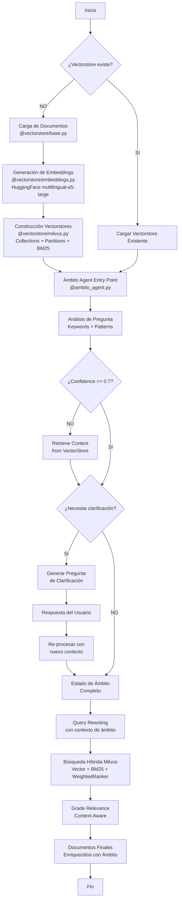

```mermaid
flowchart TD
    A[Inicio] --> B{¿Vectorstore existe?}
    
    B -->|NO| C[Carga de Documentos<br/>@vectorstore/base.py]
    C --> D[Generación de Embeddings<br/>@vectorstore/embeddings.py<br/>HuggingFace multilingual-e5-large]
    D --> E[Construcción Vectorstores<br/>@vectorstore/milvus.py<br/>Collections + Partitions + BM25]
    E --> F[Ámbito Agent Entry Point<br/>@ambito_agent.py]
    
    B -->|SI| G[Cargar Vectorstore Existente]
    G --> F
    
    F --> H[Análisis de Pregunta<br/>Keywords + Patterns]
    H --> I{¿Confidence >= 0.7?}
    
    I -->|NO| J[Retrieve Context<br/>from VectorStore]
    J --> K{¿Necesita clarificación?}
    I -->|SI| K
    
    K -->|SI| L[Generar Pregunta<br/>de Clarificación]
    L --> M[Respuesta del Usuario]
    M --> N[Re-procesar con<br/>nuevo contexto]
    N --> O[Estado de Ámbito<br/>Completo]
    
    K -->|NO| O
    
    O --> P[Query Rewriting<br/>con contexto de ámbito]
    P --> Q[Búsqueda Híbrida Milvus<br/>Vector + BM25 + WeightedRanker]
    Q --> R[Grade Relevance<br/>Context-Aware]
    R --> S[Documentos Finales<br/>Enriquecidos con Ámbito]
    S --> T[Fin]
``` 